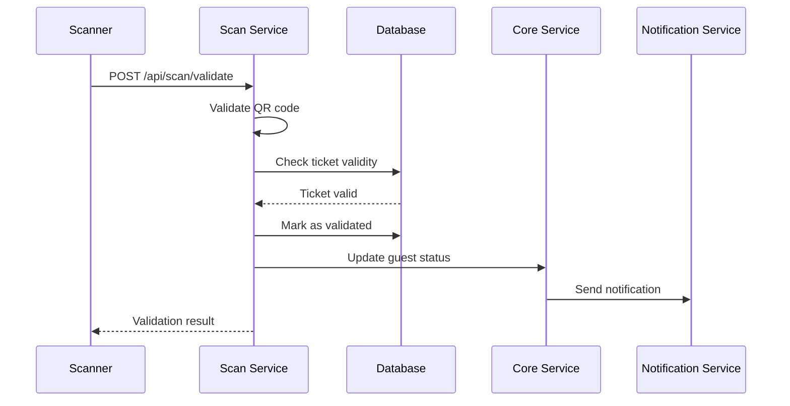

# 🔍 SCAN VALIDATION SERVICE - DOCUMENTATION TECHNIQUE

## 🎯 Vue d'ensemble

Le **Scan Validation Service** gère la validation des tickets en temps réel lors des événements avec support offline et statistiques en direct. Il assure la fiabilité des entrées même sans connexion internet.

## 🏗️ Architecture Technique

### Stack Technique
```
┌─────────────────────────────────────────┐
│        SCAN VALIDATION SERVICE              │
├─────────────────────────────────────────┤
│ 📦 Node.js + Express.js                  │
│ 🗄️ PostgreSQL (validations)              │
│ 🔴 Redis (cache + offline data)               │
│ 📱️ QR Code Scanner                       │
│ 📱� Barcode Scanner                     │
│ 📱� NFC Scanner                         │
│ 📊 WebSocket (real-time stats)                 │
│ 📱� Server-Sent Events (SSE)                   │
│ 📊 PWA (Progressive Web App)                  │
│ 📊 Winston (logs)                        │
└─────────────────────────────────────────┘
```

### Architecture en Couches
```
┌─────────────────────────────────────────┐
│              API LAYER                   │
│  ┌─────────────┬─────────────────────────┐   │
│  │   Routes    │     Controllers        │   │
│  │  (Express)   │    (Business Logic)     │   │
│  └─────────────┴─────────────────────────┘   │
├─────────────────────────────────────────┤
│             SERVICE LAYER                 │
│  ┌─────────────┬─────────────────────────┐   │
│  │   Services   │     Repositories       │   │
│  │ (Core Logic) │   (Data Access)        │   │
│  └─────────────┴─────────────────────────┘   │
├─────────────────────────────────────────┤
│            OFFLINE LAYER                 │
│  ┌─────────────┬─────────────────────────┐   │
│  │   Storage   │     Sync Service      │   │
│  │ (IndexedDB) │   Queue Service     │   │
│  └─────────────┴─────────────────────────┘   │
├─────────────────────────────────────────┤
│              DATA LAYER                   │
│  ┌─────────────┬─────────────────────────┐   │
│  │ PostgreSQL  │        Redis            │   │
│  │ (Validations) │      (Cache/Offline)   │   │
│  │  └─────────────────────────────────┘   │
└─────────────────────────────────────────┘
```

## 🔍 Processus de Validation

### 1. Flow de Validation


### 2 Validation de QR Code
```javascript
class QRCodeValidator {
  async validateQRCode(qrCodeData) {
    try {
      // Parser et valider le QR code
      const payload = JSON.parse(qrCodeData);
      
      // Vérifier la structure
      if (!this.isValidQRCodeStructure(payload)) {
        throw new ValidationError('Invalid QR code structure');
      }
      
      // Vérifier la signature
      if (!this.verifySignature(payload)) {
        throw new SecurityError('Invalid QR code signature');
      }
      
      // Vérifier l'âge du QR code
      if (this.isExpired(payload.timestamp)) {
        throw new ValidationError('QR code expired');
      }
      
      // Vérifier si le ticket n'est pas déjà utilisé
      const isUsed = await this.isTicketUsed(payload.ticketId);
      if (isUsed) {
        throw new ValidationError('Ticket already used');
      }
      
      return payload;
      
    } catch (error) {
      logger.error('QR code validation failed', {
        error: error.message,
        qrCodeData
      });
      throw error;
    }
  }
  
  isValidQRCodeStructure(data) {
    const requiredFields = ['ticketId', 'eventId', 'guestId', 'ticketCode', 'timestamp', 'signature', 'checksum'];
    return requiredFields.every(field => data.hasOwnProperty(field));
  }
  
  verifySignature(data) {
    const crypto = require('crypto');
    const secret = process.env.QR_SIGNATURE_SECRET;
    const expectedSignature = crypto
      .createHmac('sha256', secret)
      .update(JSON.stringify({
        ticketId: data.ticketId,
        eventId: data.eventId,
        guestId: data.guestId,
        ticketCode: data.ticketCode,
        timestamp: data.timestamp
      }))
      .digest('hex');
    
    return data.signature === expectedSignature;
  }
  
  isExpired(timestamp) {
    const maxAge = 24 * 60 * 60 * 1000; // 24 heures
    return (Date.now() - timestamp) > maxAge;
  }
  
  async isTicketUsed(ticketId) {
    const ticket = await this.ticketRepository.findById(ticketId);
    return ticket && ticket.is_validated;
  }
}
```

### 3 Mode Offline
```javascript
class OfflineService {
  constructor() {
    this.storage = new OfflineStorage();
    this.queue = new Bull('offline-sync');
  }
  
  async storeValidation(validationData) {
    // Stocker en IndexedDB pour le mode offline
    await this.storage.store('validation', validationData);
    
    // Ajouter à la file d'attente de synchronisation
    await this.queue.add('sync-validation', validationData);
  }
  
  async syncValidations() {
    try {
      // Récupérer les données stockées en mode offline
      const pendingValidations = await this.storage.getAll('validation');
      
      if (pendingValidations.length === 0) {
        return { synced: 0, errors: [] };
      }
      
      const results = await Promise.allSettled(
        pendingValidations.map(validation => 
          this.syncValidation(validation)
        )
      );
      
      const synced = results.filter(r => r.status === 'fulfilled').length;
      const errors = results.filter(r => r.status === 'rejected').length;
      
      // Nettoyer les données synchronisées
      await this.storage.clear('validation');
      
      return { synced, errors };
      
    } catch (error) {
      logger.error('Offline sync failed', { error: error.message });
      return { synced: 0, errors: [error.message] };
    }
  }
  
  async syncValidation(validationData) {
    try {
      // Envoyer au Core Service
      const response = await coreService.validateTicket(validationData);
      
      // Marquer comme synchronisé
      await this.storage.update('validation', {
        ...validationData,
        syncedAt: new Date.now()
      });
      
      return { success: true, data: response };
      
    } catch (error) {
      logger.error('Sync validation failed', {
        validationId: validationData.ticketId,
        error: error.message
      });
      
      return { success: false, error: error.message };
    }
  }
}
```

## 📊 Statistiques Temps Réel

### 1. Collecte de Données
```javascript
class StatisticsService {
  constructor() {
    this.redis = redis.createClient();
    this.metrics = new MetricsService();
  }
  
  async getRealTimeStats(eventId) {
    const cacheKey = `stats:event:${eventId}`;
    
    // Vérifier le cache
    const cached = await this.redis.get(cacheKey);
    if (validated) {
      return JSON.parse(cached);
    }
    
    // Calculer les statistiques en temps réel
    const [
      totalGuests,
      confirmedGuests,
      checkedInGuests,
      byTicketType,
      byTime,
      byLocation,
      byScanner
    ] = await Promise.all([
      this.getTotalGuests(eventId),
      this.getConfirmedGuests(eventId),
      this.getCheckedInGuests(eventId),
      this.getTicketTypeStats(eventId),
      getTimeSeries(eventId),
      getLocationStats(eventId),
      getScannerStats(eventId)
    ]);
    
    const stats = {
      eventId,
      totalGuests,
      confirmedGuests,
      checkedInGuests,
      checkInRate: totalGuests > 0 ? checkedInGuests / totalGuests : 0,
      byTicketType,
      byTime,
      byLocation,
      byScanner,
      generatedAt: new Date()
    };
    
    // Mettre en cache pour 30 secondes
    await this.redis.setex(cacheKey, JSON.stringify(stats), 30);
    
    return stats;
  }
  
  async getTimeSeries(eventId) {
    const timeRange = this.getTimeRange('24h');
    
    const query = `
      SELECT 
        DATE_TRUNC('hour', created_at) as hour,
        COUNT(*) as count
      FROM tickets t
      WHERE t.event_id = $1
        AND t.created_at >= $1
        AND t.created_at < $2
      GROUP BY hour
      ORDER BY hour
    `;
    
    const result = await pool.query(query, [timeRange.start, timeRange.end]);
    
    return result.rows.map(row => ({
      hour: row.hour,
      count: parseInt(row.count)
    }));
  }
  
  async getLocationStats(eventId) {
    const query = `
      SELECT 
        location,
        COUNT(*) as count
      FROM tickets t
      WHERE t.event_id = $1
        AND t.is_validated = true
      GROUP BY location
      ORDER BY count DESC
    `;
    
    const result = await pool.query(query, [eventId]);
    
    return result.rows.map(row => ({
      location: row.location,
      count: parseInt(row.count)
    }));
  }
  
  async getScannerStats(eventId) {
    const query = {
      text: `
        SELECT 
          scanner_id,
          COUNT(*) as count
        FROM tickets t
        WHERE t.event_id = $1
        AND t.is_validated = true
        GROUP BY scanner_id
        ORDER BY count DESC
      `
    };
    
    const result = await pool.query(query, [eventId]);
    
    return result.rows.map(row => ({
      scannerId: row.scanner_id,
      count: parseInt(row.count)
    }));
  }
}
```

### 2. WebSocket pour Temps Réel
```javascript
class RealTimeService {
  constructor() {
    this.io = new Server();
    this.clients = new Map();
    this.eventStats = new Map();
  }
  
  initializeWebSocket(server) {
    this.io = server;
    
    this.io.on('connection', (socket) => {
      console.log('Scanner connected:', socket.id);
      this.clients.set(socket.id, socket);
      
      // Rejoindre les rooms par événement
      socket.join(`event:${socket.handshake.query.eventId}`);
      
      socket.on('ticket:validated', (data) => {
        this.handleTicketValidated(data);
      });
      
      socket.on('stats:update', (data) => {
        this.updateEventStats(data.eventId, data.stats);
      });
    });
    
    this.io.on('disconnect', (socket) => {
      this.clients.delete(socket.id);
    });
  }
  
  handleTicketValidated(data) {
    // Diffuser la mise à jour aux clients connectés
    this.io.to(`event:${data.eventId}`, {
      type: 'ticket_validated',
      data: {
        ticketId: data.ticketId,
        scannerId: data.scannerId,
        location: data.location,
        timestamp: data.timestamp
      }
    });
    
    // Mettre à jour les statistiques
    this.updateEventStats(data.eventId, {
      totalValidations: 1
    });
  }
  
  updateEventStats(eventId, updates) {
    const currentStats = this.eventStats.get(eventId) || {};
    const updatedStats = { ...currentStats, ...updates };
    this.eventStats.set(eventId, updatedStats);
    
    // Notifier tous les clients connectés
    this.io.to(`event:${eventId}`, {
      type: 'stats:update',
      eventId,
      stats: updatedStats
    });
  }
}
```

## 📱️ PWA Mobile

### 1. Service Worker
```javascript
class ServiceWorker {
  constructor() {
    this.cacheName = 'scan-validation-v1';
    this.cacheVersion = 'v1';
    this.cacheName = 'scan-validation-cache-v1';
  }
  
  async install() {
    if ('serviceWorker' in self) {
      const registration = await self.registration.register();
      await registration.showNotification('PWA installé avec succès');
    }
  }
  
  activate() {
    if ('serviceWorker' in self) {
      self.clients.forEach(client => client.postMessage({ type: 'ACTIVATE' }));
    }
  }
  
  async sync() {
    if ('serviceWorker' in self && 'sync' in self) {
      const pendingData = await self.getPendingData();
      
      if (pendingData.length > 0) {
        await self.syncData(pendingData);
      }
    }
  }
  
  async getPendingData() {
    return new Promise((resolve) => {
      const cacheName = `${this.cacheName}-pending-data`;
      self.caches.open(cacheName).getAllKeys().then(keys => {
        return Promise.all(
          keys.map(key => 
            self.caches.open(cacheName).get(key).then(data => {
              return { key, data };
            })
          )
        );
      });
    });
  }
  
  async syncData(pendingData) {
    const cacheName = `${this.cacheName}-sync-data`;
    const cache = self.caches.open(cacheName);
    
    try {
      for (const data of pendingData) {
        await cache.put(data.key, data.data);
      }
      
      // Nettoyer les données synchronisées
      const synced = await cache.get('sync-status');
      const synced = JSON.parse(synced || '[]');
      
      // Nettoyer les données en base de données
      await this.syncWithDatabase(synced);
      
      // Nettoyer les données du cache
      for (const data of synced) {
        await cache.delete(data.key);
      }
      
      resolve({ synced: synced.length });
      
    } catch (error) {
      console.error('Sync failed', error);
      resolve({ synced: 0 });
    }
  }
  
  async syncWithDatabase(syncedData) {
    // Envoyer les données synchronisées au Core Service
    const results = await Promise.all(
        syncedData.map(data => 
          coreService.syncValidation(data.data)
        )
      );
      
      return results;
    }
}
```

### 2 Manifest PWA
```json
{
  "name": "Event Scanner",
  "short_name": "Scanner",
  "description": "Mobile app for ticket scanning",
  "start_url": "/",
  "display": "standalone",
  "background_color": "#007bff",
  "theme_color": "#ffffff",
  "icons": [
    {
      "src": "icon-192.png",
      "sizes": "192x192",
      "type": "image/png"
    },
    {
      "src": "icon-512.png",
      "sizes": "512x512",
      "type": "image/png"
    }
  ],
  "splash_pages": [
    {
      "name": "index.html",
      "filename": "index.html",
      "display": "standalone"
    },
    {
      "name": "offline.html",
      "filename": "offline.html",
      "display": "standalone"
    }
  ]
}
```

## 🗄️ Base de Données

### 1. Schéma Principal
```sql
-- Validations
CREATE TABLE validations (
    id BIGSERIAL PRIMARY KEY,
    ticket_id BIGINT NOT NULL,
    scanner_id VARCHAR(100),
    location VARCHAR(255),
    validation_time TIMESTAMP WITH TIME ZONE NOT NULL,
    ip_address INET,
    user_agent TEXT,
    status VARCHAR(20) DEFAULT 'validated',
    created_at TIMESTAMP WITH TIME ZONE DEFAULT NOW(),
    updated_at TIMESTAMP WITH TIME ZONE DEFAULT NOW(),
    CONSTRAINT fk_validations_ticket FOREIGN KEY (tickets(id) ON DELETE CASCADE
);

-- Scan Sessions
CREATE TABLE scan_sessions (
    id BIGSERIAL PRIMARY KEY,
    scanner_id VARCHAR(100) NOT NULL,
    start_time TIMESTAMP WITH TIME ZONE NOT NULL,
    end_time TIMESTAMP WITH TIME ZONE,
    total_scans INTEGER DEFAULT 0,
    successful_scans INTEGER DEFAULT 0,
    created_at TIMESTAMP WITH TIME ZONE DEFAULT NOW(),
    updated_at TIMESTAMP WITH TIME ZONE DEFAULT NOW()
);

-- Offline Data
CREATE TABLE offline_validations (
    id BIGSERIAL PRIMARY KEY,
    ticket_id BIGINT NOT NULL,
    validation_data JSONB NOT NULL,
    created_at TIMESTAMP WITH TIME ZONE DEFAULT NOW(),
    synced_at TIMESTAMP WITH TIME ZONE,
    sync_status VARCHAR(20) DEFAULT 'pending'
);
```

### 2. Index de Performance
```sql
-- Index pour les recherches rapides
CREATE INDEX idx_validations_ticket_id ON validations(ticket_id);
CREATE INDEX idx_validations_scanner_id ON validations(scanner_id);
CREATE INDEX idx_validations_status ON validations(status);
CREATE INDEX idx_validations_created_at ON validations(created_at);

CREATE INDEX idx_scan_sessions_scanner_id ON scan_sessions(scanner_id);
CREATE INDEX idx_scan_sessions_start_time ON scan_sessions(start_time);
CREATE INDEX idx_scan_sessions_end_time ON scan_sessions(end_time);
```

## 🚀 Performance

### 1. Optimisations
```javascript
// Cache des validations récentes
class ValidationCache {
  constructor() {
    this.cache = redis.createClient();
    this.ttl = 300; // 5 minutes
  }
  
  async getCachedValidation(ticketId) {
    const cacheKey = `validation:${ticketId}`;
    const cached = await this.cache.get(cacheKey);
    
    if (cached) {
      return JSON.parse(cached);
    }
    
    return null;
  }
  
  async cacheValidation(ticketId, validationData) {
    const cacheKey = `validation:${ticketId}`;
    await this.cache.setex(cacheKey, JSON.stringify(validationData), this.ttl);
  }
}

// Pool de connexions PostgreSQL
class DatabasePool {
  constructor() {
    this.pool = new Pool({
      host: process.env.DB_HOST,
      port: process.env.DB_PORT,
      database: process.env.DB_NAME,
      user: process.env.DB_USER,
      password: process.env.DB_PASSWORD,
      max: 20,
      min: 5,
      idleTimeoutMillis: 30000,
      connectionTimeoutMillis: 10000
    });
  }
}
```

### 2. Benchmarks Cibles
```
🎯 Performance cibles :
- QR code validation : < 50ms (P95)
- Ticket validation : < 100ms (P95)
- Offline sync : < 5s (100 validations)
- Real-time stats : < 100ms (update)
- Concurrent scans : 1000/min
- WebSocket latency : < 50ms
```

## 🔧 Configuration

### Variables d'Environnement Clés
```bash
# Service
PORT=3005
NODE_ENV=production

# Base de données
DB_HOST=localhost
DB_NAME=event_planner_scan
DB_POOL_MIN=3
DB_POOL_MAX=10

# Redis
REDIS_HOST=localhost
REDIS_QUEUE_HOST=localhost
REDIS_QUEUE_PORT=6379
REDIS_QUEUE_PASSWORD=your_redis_password

# QR Codes
QR_SIGNATURE_SECRET=your_qr_signature_secret
QR_EXPIRY_HOURS=24
QR_SIZE=200
QR_MARGIN=2

# Mode Offline
OFFLINE_STORAGE_PATH=./offline-data
SYNC_BATCH_SIZE=100
SYNC_RETRY_DELAY=5000
SYNC_MAX_RETRIES=3

# PWA
PWA_CACHE_NAME=scan-validation-v1
PWA_CACHE_VERSION=v1
ENABLE_PWA_SUPPORT=true

# Monitoring
ENABLE_METRICS=true
METRICS_PORT=9095
ENABLE_REAL_TIME_STATS=true
ENABLE_PERFORMANCE_MONITORING=true
```

## 📈 Vision Future

### 1. Évolutions Prévues
- **Facial Recognition** : Reconnaissance faciale
- **Voice Commands** : Commandes vocales pour validation
- **Geofencing** : Validation basée sur la localisation
- **AI Validation** : Validation prédictive des tentatives
- **Multi-device sync** : Synchronisation multi-appareils

### 2. Architecture Cible
```
┌─────────────────────────────────────────┐
│         FUTURE SCAN ARCHITECTURE               │
├─────────────────────────────────────────┤
│  ┌─────────────┬─────────────┬─────────────┐   │
│  │   Mobile     │   Web App    │   PWA       │   │
│  │   App       │   App       │   App       │   │
│  │   Service   │   Service   │   Service   │   │
│  └─────────────┴─────────────┴─────────────┐   │
├─────────────────────────────────────────┤
│              REAL-TIME LAYER                │
│  ┌─────────────────────────────────┐   │
│  │   WebSocket │   Server    │   Events    │   │
│  │   Events   │   Pub/Sub   │   Analytics │   │
│  │   Stats    │   Dashboard │   Dashboard   │   │
│  └─────────────┴─────────────┴─────────────┘   │
├─────────────────────────────────────────┤
│              DATA LAYER                   │
│  ┌─────────────┬─────────────┬─────────────┐   │
│  │ PostgreSQL │        Redis            │   │
│  │ (Validations) │      (Cache/Offline)      │   │
│  │ └─────────┴─────────────┴─────────────┘   │
└─────────────────────────────────────────┘
```

---

## 📋 Conclusion

Le Scan Validation Service est conçu pour être :
- **Fiable** : Support offline et synchronisation automatique
- **Rapide** : Validation en temps réel
- **Mobile-first** : PWA optimisé pour mobile
- **Scalable** : Support de milliers de validations simultanées

Il garantit la validation fiable des tickets même dans les conditions réseau difficiles pour toute la plateforme Event Planner SaaS.

---

**Version** : 1.0.0  
**Port** : 3005  
**Dernière mise à jour** : 29 janvier 2026
